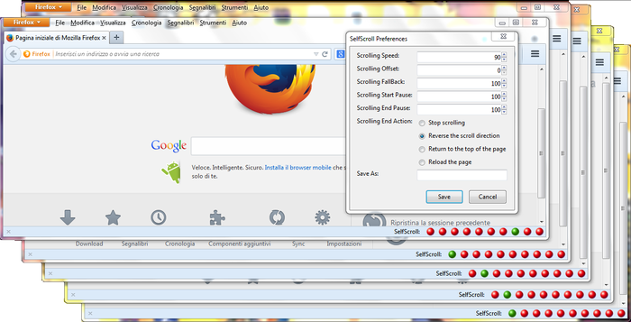

SelfScroll
==========

This is a Mozilla extension that allow to automatically scroll the page with a custom speed. It also possible to configure the action to execute at the end of the page or at a specific pixel offset. Is possible to configure up to 10 different settings to run in different browser windows (suitable for multi-screen).

To use the extension, you need to have the addon bar enabled. If the option is not available in your version of Firefox, install the [addon bar extension](https://addons.mozilla.org/it/firefox/addon/the-addon-bar/). Once the addon bar is visible, just left-click one of the red circles to enable the automatic scrolling and right-click it to change the settings.

This extension can't scroll pages in background tabs, only the current tab of each window. Open multiple windows to scroll multiple tabs at once.

Screen
==========

